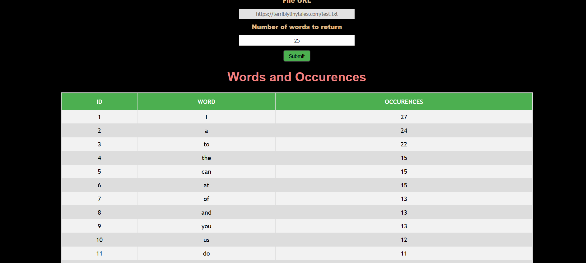

# string-count-react[](https://travis-ci.org/dopecodez/string-count-react)



A string recurrence counter made with React. Will get the N number of strings and their occurences for given url. Also has unit tests on top of this with Jest and Enzyme. The backend is [here](https://github.com/dopecodez/string-counter-express). You can find the site hosted on heroku here: https://morning-savannah-24852.herokuapp.com/

If you have any doubts or clarifications on this code, hit me up and I'll try to help you guys out!

## Getting Started

These instructions will get you a copy of the project up and running on your local machine for development and testing purposes. 

### Prerequisites

You'll need to install NodeJS for running this application. I'm on Node v10.5.3, you can find it at:
```
https://nodejs.org/en/download/
```
You'll also need a code editor to see how the code goes. Use whichever editor which has JS support, I use Visual Studio Code on 
Windows 10.

### Installing

Simple steps to get the application running. Open the terminal to the folder containing string-counter-express and just type:
```
npm install
```
This should install all the dependencies within package.json and create your package-lock.json and node modules.

After the previous command completes successfully, open the terminal and type:
```
npm start
```
This should get the program up and running on the default port.

To run the tests, all you need to do is, type:

```
npm test
```
## Usage

Once program is up and running, you can see the page at localhost:3000. It is a simple page with just two elements a form filling in url and number and a table for displaying the data. Right now, the url is hardcoded. As mentioned earlier, site is hosted on https://morning-savannah-24852.herokuapp.com/

## Built With

* [React](https://reactjs.org/) - The Javascript framework used
* [create-react-app](https://www.npmjs.com/package/create-react-app) - Project was bootstraped with create-react-app
* [react-loader-spinner](https://www.npmjs.com/package/react-loader-spinner) - For creating visual loaders
* [jest](https://jestjs.io/) - JavaScript Testing Framework with a focus on simplicity
* [enzyme](https://airbnb.io/enzyme/) - JavaScript Testing utility for React that makes it easier to test your React Components' output

## Contributing

Anybody with ideas to genuinely improve the project are welcome. We use git flow, so just pull the repo, cut a branch on develop and put a pull request back to us. We will look through the PR as soon as possible. We suggest you make sure your PR passes all unit tests, and add further unit tests for any new functionalities introduced.

## Versioning
Currently, no versions are available. Will update soon

## Authors

* **Govind S** - *Initial work* - [dopecodez](https://github.com/dopecodez)

## License

This project is free. Use it in whichever way you please.

## Acknowledgments

* Hat tip to anyone whose code was used
